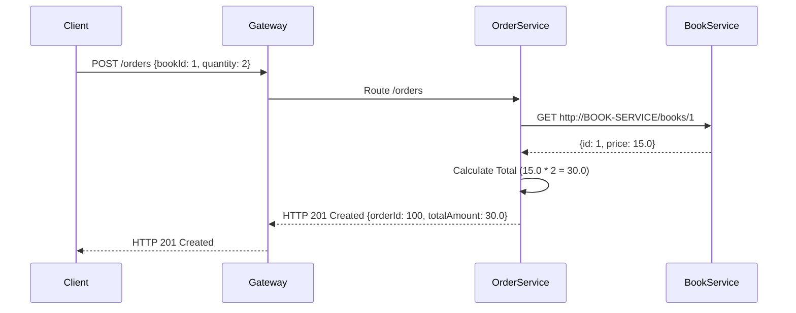

# System Design Document: BookMesh

## 1. Introduction
BookMesh is a minimalist e-commerce platform designed to demonstrate core microservices concepts including Service Discovery, API Gateway routing, and Inter-Service Communication. 

## 2. Architecture Overview
The application follows a standard Microservices Architecture pattern using Spring Cloud.

### 2.1 Components
*   **Service Registry (Eureka Server):** Centralized registry for all microservices.
*   **API Gateway (Spring Cloud Gateway):** Single entry point for all client requests. Handles routing to backend services.
*   **Book Service:** Core business service managing the book catalog.
*   **Order Service:** Core business service managing customer orders. Depends on Book Service for product details.

### 2.2 System Architecture Diagram
```mermaid
graph TD
    Client((Client/Postman)) -->|REST / HTTP| Gateway(API Gateway)
    Gateway -->|/books/**| BookService(Book Service)
    Gateway -->|/orders/**| OrderService(Order Service)
    
    OrderService -.->|REST HTTP GET /books/{id}| BookService
    
    BookService -.->|Registers/Heartbeat| Eureka(Service Registry)
    OrderService -.->|Registers/Heartbeat| Eureka
    Gateway -.->|Registers/Heartbeat| Eureka
```

## 3. Component Details

### 3.1 Service Registry
*   **Port:** `8761`
*   **Role:** Maintains a directory of available service instances. 
*   **Key Config:** `eureka.client.register-with-eureka=false`, `eureka.client.fetch-registry=false`

### 3.2 API Gateway
*   **Port:** `8080`
*   **Role:** Reverse proxy and routing mechanism.
*   **Routes:**
    *   `id: book-service-route`, `uri: lb://BOOK-SERVICE`, `predicates: Path=/books/**`
    *   `id: order-service-route`, `uri: lb://ORDER-SERVICE`, `predicates: Path=/orders/**`

### 3.3 Book Service
*   **Port:** `8081` (or random `0` if scaled)
*   **Application Name:** `BOOK-SERVICE`
*   **Data Model (Book):**
    *   `id` (Long)
    *   `title` (String)
    *   `author` (String)
    *   `price` (Double)
*   **Endpoints:**
    *   `GET /books`: Returns `List<Book>`
    *   `GET /books/{id}`: Returns `Book`

### 3.4 Order Service
*   **Port:** `8082` (or random `0` if scaled)
*   **Application Name:** `ORDER-SERVICE`
*   **Data Model (Order):**
    *   `orderId` (Long)
    *   `bookId` (Long)
    *   `quantity` (Integer)
    *   `totalAmount` (Double)
*   **Endpoints:**
    *   `POST /orders`: Accepts JSON `{ "bookId": 1, "quantity": 2 }`.
*   **Business Logic:**
    1. Receives order request.
    2. Makes an HTTP GET request to `http://BOOK-SERVICE/books/{bookId}` using `RestTemplate` or `RestClient`.
    3. Extracts `price` from the response.
    4. Calculates `totalAmount = price * quantity`.
    5. Saves and returns the `Order` object.

## 4. Sequence Diagram (Order Placement)



## 5. Technology Stack
*   **Language:** Java 17+
*   **Framework:** Spring Boot 3.x
*   **Microservices Framework:** Spring Cloud 
*   **Inter-service Communication:** Spring `RestTemplate` or `RestClient`
*   **Build Tool:** Maven or Gradle
